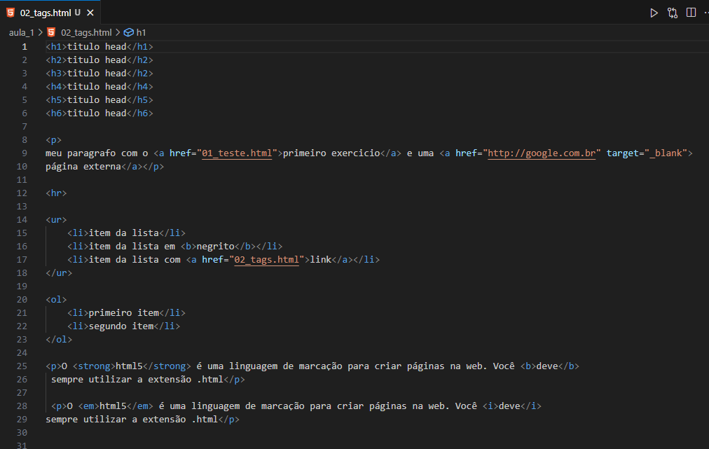

# HTML CSS JAVASCRIPT

  - [Tecnologias Usadas](#Tecnologias-Usadas)
  - [Sobre](#Sobre)
  - [Aula 1 Tags](#Aula-1)
  
  
## Tecnologias Usadas

[HTML5](https://pt.wikipedia.org/wiki/HTML5) /  [CSS3](https://pt.wikipedia.org/wiki/CSS3) / [JavaScript](https://pt.wikipedia.org/wiki/JavaScript)

## Sobre

Aprendendo Front-end com HTML5, CSS e JavaScript do zero ao avançado com aprendizados retirados de um canal [aulas no youtube](https://www.youtube.com/watch?v=0Pm6ex5HDGY&list=PL1dUY2RYa2RhNhm-QTuNIifVpc59wrpFP&index=1&ab_channel=Serliv) 

## Aula 1

A primeira aula é sobre Tags que são utilizados no HTML:

