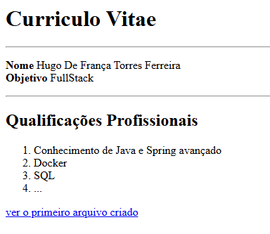

# HTML CSS JAVASCRIPT

  - [Tecnologias Usadas](#Tecnologias-Usadas)
  - [Sobre](#Sobre)
  - [Aula 1 Tags](#Aula-1)
  
  
## Tecnologias Usadas

[HTML5](https://pt.wikipedia.org/wiki/HTML5) /  [CSS3](https://pt.wikipedia.org/wiki/CSS3) / [JavaScript](https://pt.wikipedia.org/wiki/JavaScript)

## Sobre

Aprendendo Front-end com HTML5, CSS e JavaScript do zero ao avançado com aprendizados retirados de um canal [aulas no youtube](https://www.youtube.com/watch?v=0Pm6ex5HDGY&list=PL1dUY2RYa2RhNhm-QTuNIifVpc59wrpFP&index=1&ab_channel=Serliv) 

## Aula 1 

### A primeira aula é sobre Tags que são utilizados no HTML

As tags são elementos que definem a estrutura e o conteúdo de uma página web. Elas são usadas para marcar partes específicas do conteúdo — como parágrafos, títulos, imagens, links, listas, tabelas etc. Para
Definir uma tag você precisa abrir e fechar um elemento (dessa forma "<h1></h2>"), sendo o segundo elementro o fechamento deve conter "/". 

O "h1" é o elemento do titulo, que usamos para descrever um titulo. Existe também o h2 h3 h4... que são substitulos que responde uma hierarquia.

O proximo elemento é 
 que é usado para determinar um paragrafó com texto, e você pode utilizar outras tags dentro, respeitando a hierarquia.

A tag "a" serve para você adicionar referencia para link, você pode refenciar para uma pagina que está no seu projeto com o "<a href= "outrapagina.html >", você referenciar para alguma outra pagina web com
"<a href= "http://www.google.com>", entre outras formas de link.

Existe tags que não repcisa de fechamento é o caso da 
, ela serve para quebrar linha.

A tag "ur" serve para criar uma lista não ordenada em conjunto com a tag <li> que serve para listar os itens .

A tag "ol" serve para criar uma lista não ordenada em conjunto com a tag <li> que serve para listar os itens .

As tags "strong" e <b> servem para dizer que tal palavra ou frase está em negrito

As tags "em" e "i" servem para dizer que tal palavra ou frase está em itálico.

Na Aula o professor propos aos alunos fizessem um exercicio para ratificar o aprendizado:

A Aula é personalizado então você pode fazer do jeito que quiser.

## Aula 2
